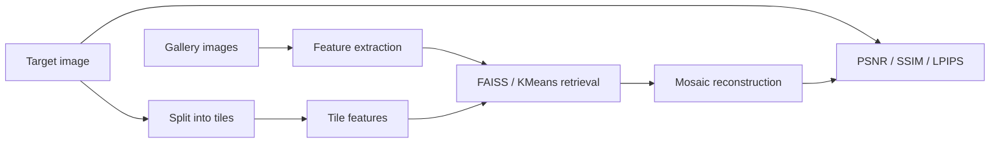

# Image Mosaic Retrieval

A modular computer-vision pipeline that reconstructs a target image from a
gallery of small images. It combines handcrafted and shallow CNN features,
FAISS or KMeans retrieval, mosaic reconstruction, quantitative evaluation, and
feature-weight search.

## What this demonstrates

- Image tiling and deterministic feature extraction
- RGB, HSV, color-histogram, HOG, edge-density, and shallow VGG16 features
- Weighted feature fusion with explicit normalization
- Scalable cosine-similarity search with FAISS
- Cluster-pruned retrieval with MiniBatchKMeans
- PSNR, SSIM, and LPIPS evaluation
- Reusable pipeline functions plus a self-contained synthetic demo



## Quick demo

Requires Python 3.10+.

```bash
python -m venv .venv
source .venv/bin/activate
python -m pip install -r requirements.txt
python demo.py --output-dir demo_output
```

The demo generates its own geometric target and gallery images, extracts RGB
features, performs FAISS matching, and writes the reconstructed mosaic under
`demo_output/`. It downloads no dataset and no model weights.

## Use a real gallery

```python
from mosaic_pipeline import (
    extract_features_from_folder,
    extract_tile_features,
    match_tiles_to_gallery_faiss,
    reconstruct_mosaic_image,
)

extract_features_from_folder("gallery", "combined", "gallery.pkl", w_color=0.7, w_hog=0.3)
extract_tile_features("target.jpg", 32, "combined", "tiles.pkl", w_color=0.7, w_hog=0.3)
match_tiles_to_gallery_faiss("tiles.pkl", "gallery.pkl", "matches.pkl")
reconstruct_mosaic_image("matches.pkl", "gallery", 32, "mosaic.jpg")
```

The feature caches use Python pickle for speed. Load only caches you generated
locally; pickle files from untrusted sources can execute code.

## Historical experiment results

The original course experiment used a private Tiny ImageNet-derived gallery.
That dataset and the original report are excluded from the public repository.
The strongest reported SSIM was `0.4227` for the shallow-CNN configuration,
with a higher runtime than lightweight color features. Full historical results
and limitations are recorded in [docs/RESULTS.md](docs/RESULTS.md).

These values are a record of one past run, not a reproducible benchmark from
the synthetic demo.

## Repository map

```text
mosaic_pipeline.py     feature extraction, matching, reconstruction
evaluator.py           PSNR, SSIM, LPIPS, and weight search
demo.py                deterministic end-to-end smoke demo
tests/                 focused tests for core edge cases
notebooks/             cleaned historical exploration notebooks
docs/RESULTS.md        historical experiment table and caveats
```

## Verification

```bash
python -m compileall -q .
pytest -q
```

## Data and model notes

No third-party image dataset is committed. See [DATA_SOURCES.md](DATA_SOURCES.md)
before using ImageNet-family data. CNN and LPIPS paths may download pretrained
weights on first use; the default RGB demo avoids that behavior.

## Limitations

- The best feature mix depends on the target image and gallery distribution.
- Pixel metrics do not fully capture human preference or mosaic aesthetics.
- KMeans adds approximation error and can be slower than FAISS at this scale.
- CNN and LPIPS features increase runtime and introduce external model weights.
- Historical timing claims depend on specific hardware and dataset scale.

## License

Code is released under the MIT License. Datasets, pretrained weights, and user
images retain their own licenses and terms.
